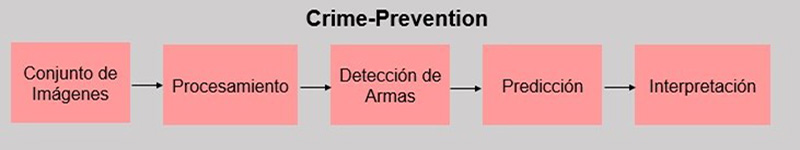

# Crime-Prevention

Este proyecto propone detectar armas en imagen y/o video.
Enfocado para poder usarse en camaras de vigilancia en casas,negocios u otros.

## Contenido
- [Crime-Prevention](#crime-prevention)
    - [Contenido](#contenido)
- [Procedimiento](#procedimiento)
- [Tecnologias](#tecnologias)
- [Autor](#autor)
  
# Procedimiento

 
 

# Tecnologias

- [Python](https://www.python.org/)
- [Tensorflow](https://www.tensorflow.org/)
- [Opencv](https://opencv.org/)
  
# Autor
  - Jessica Jasiel Renteria Escalera